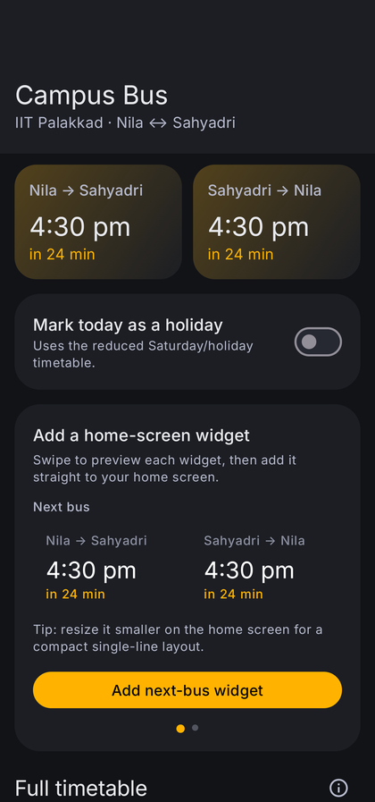
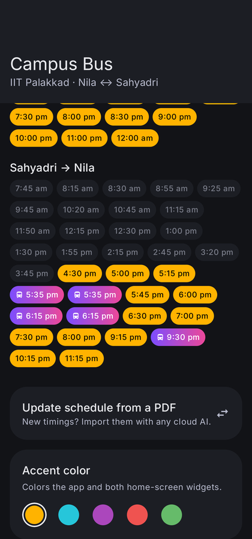
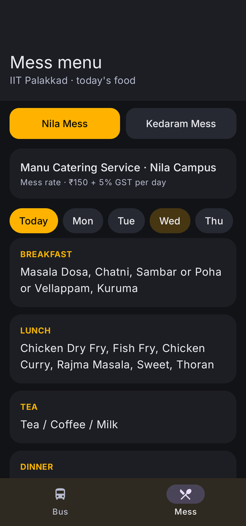
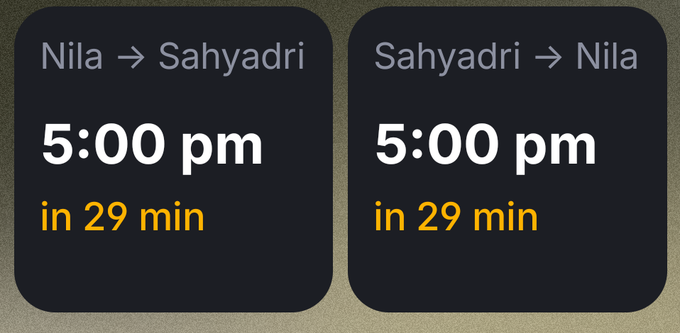
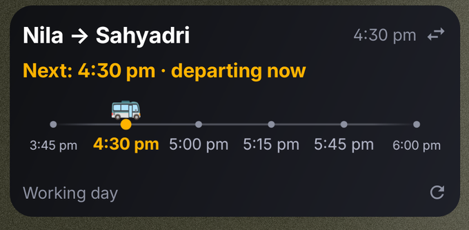

# 🚌🍽️ IITPKD Campus Buddy

A tiny Android app **+ home-screen widgets** for **IIT Palakkad** — the **Nila ↔ Sahyadri** campus
shuttle, the **mess menu** and the **academic calendar**. See the next bus each way with a live
countdown, check what's for lunch, count down to the next holiday, and keep it all a glance away on
your home screen.

## 💻 Use it on the web (desktop too)

No install needed — open the web app in any browser:

### 👉 **https://vishnuexe.github.io/iitpkd-campus-buddy/**

Same next-bus cards, live timelines and full timetable, plus the mess menu, the academic calendar, upcoming holidays, holiday greetings and a campus map (map data © OpenStreetMap contributors). On desktop Chrome/Edge, click the **Install** icon in the address bar to pin it as an app; on phones use **Add to Home Screen**. It works offline once opened.

## 📸 Screenshots

| Bus | Full timetable | Mess menu |
|:---:|:---:|:---:|
|  |  |  |

### 🏠 Home-screen widgets

| Next bus | Timeline |
|:---:|:---:|
|  |  |

Four widgets in all: the **Next bus** card (both directions, resizes down to a single line), the
**Timeline** widget with a live bus marker, a **Mess menu** widget showing today's meals, and an
**Upcoming Holidays** widget with the days left. Tap any to open the app.

## 📥 Download & install

1. Grab the latest **[APK from Releases »](../../releases/latest)**
2. Open the downloaded file. If prompted, allow **"Install unknown apps"** for whatever app opened it
   (Files, Chrome, WhatsApp…).
3. Tap **Install**. Requires **Android 8.0 (Oreo) or newer**.

> Not on the Play Store — it's a small student-made app, so you install the APK directly.

## ✨ Features

- **Next bus, both directions**, with a live "in X min" countdown.
- **Mess menu** tab — today's **Nila Mess** breakfast / lunch / tea / dinner, browsable for any day
  of the week (Kedaram Mess coming soon).
- **Academic calendar** tab — the 2026 calendar as a list (exams with slot-wise dates, deadlines,
  vacations, meetings) with filters, plus all gazetted holidays.
- **Holiday-aware bus timings** — gazetted holidays switch to the Saturday/holiday timetable
  automatically; "mark today as a holiday" resets itself the next day.
- **Four home-screen widgets:**
  - a compact **next-bus** card (resizes down to a single line),
  - a **timeline** widget with a moving bus marker, showing the "going outside" buses too,
  - a **mess-menu** widget showing today's meals, and
  - an **upcoming-holidays** widget with the days left (a list, or a slim one-row strip).

  Add any of them straight from inside the app in one tap. They size their text to fit any screen
  and font-size setting.
- **Holiday greetings** — on a holiday the app wishes you and, if you like, wears the holiday's colour.
- **Update notice** — the app and widgets tell you when a newer version is on GitHub.
- **Full timetable** with a **Today / Working / Sat-Holiday / Sunday** switch.
- **"Going outside" trips** (Palakkad Town / Wise Park Junction) highlighted with their own gradient.
- **Light / dark / system theme** and an **accent-colour** picker — applies to the app *and* the widgets.
- **Update the schedule yourself** when the timings change: paste the new bus PDF into any AI
  (ChatGPT / Gemini / Claude), copy its reply back into the app, done — no app update needed.
- **Tap a widget** to open the app; taps stay snappy and everything works fully offline.

## 🐞 Feedback & support

Found a bug or want a feature? Open an **[issue](../../issues)**, or use the in-app
**Report a bug** / **Request a feature** buttons.

If it saves you a few missed buses, there's a ☕ **Buy me a coffee** (UPI) button in the app 🙂

---

Made for IIT Palakkad students. Timetable effective 29 Jul 2026 — update it in-app whenever the college revises it.
